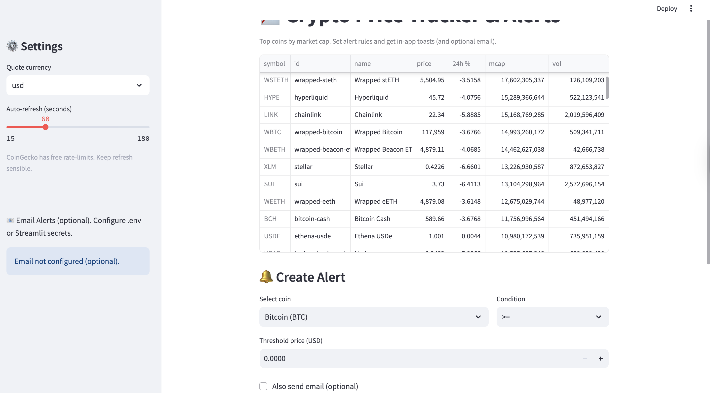

# Crypto Price Tracker & Alert App

A **Streamlit** app that tracks real-time crypto prices using the **CoinGecko API**, shows quick analytics, and triggers **threshold-based alerts** (in-app toasts and optional email).

## ✨ Features
- Select coins (Top 100 by market cap).
- Live prices, 24h change, market cap, volume.
- Optional **sparkline** mini-chart.
- Set **alert rules** (>= or <= threshold). Get **toast** notifications in the app.
- Optional **email alerts** via SMTP (Gmail or others) using `.env` secrets.
- Clean, modular code with `tracker/` package.

## 🧩 Tech
- Python, Streamlit
- CoinGecko REST (no API key needed)
- Requests, Pandas
- Optional: python-dotenv for secrets

## 🚀 Quickstart
```bash
python -m venv .venv
source .venv/bin/activate   # Windows: .venv\Scripts\activate
pip install -r requirements.txt
streamlit run app.py
```

## ⚙️ Environment (optional, for email alerts)
Create a `.env` file in the project root (copy from `.env.example`) and set:
```
SMTP_HOST=smtp.gmail.com
SMTP_PORT=587
SMTP_USER=your_email@gmail.com
SMTP_PASS=your_app_password
ALERT_TO=recipient_email@example.com
```

## 🧪 Tests
```bash
pytest -q
```

## 📁 Project Structure
```
crypto-price-tracker/
├─ app.py
├─ requirements.txt
├─ .env.example
├─ README.md
├─ tracker/
│  ├─ __init__.py
│  ├─ api.py
│  ├─ alert.py
│  ├─ config.py
│  └─ utils.py
├─ data/
│  └─ sample_alerts.json
└─ tests/
   └─ test_api_smoke.py
```
## Preview



